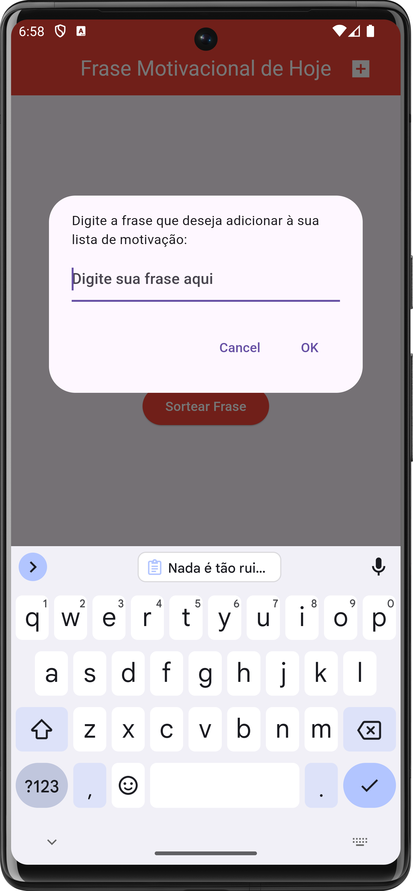
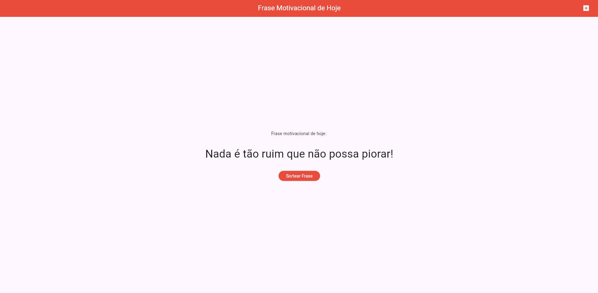
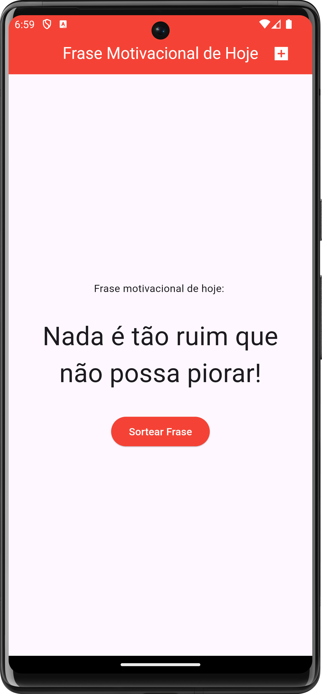
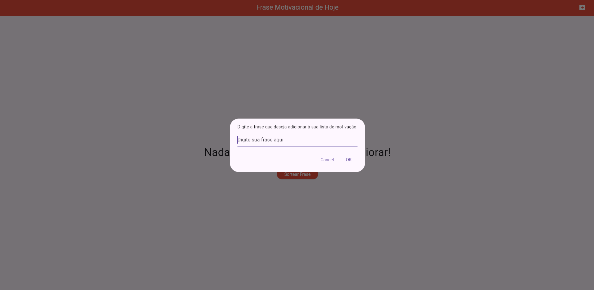

# motivacionaltips

# 📱 Motivational Quotes App

Uma aplicação simples desenvolvida em Flutter que permite aos usuários adicionar frases motivacionais e visualizá-las posteriormente. A interface é intuitiva e utiliza um `Dialog` para adicionar novas frases à lista. O design foi pensado para facilitar a experiência do usuário e o fluxo de interação.

## 🖼️ Screenshots

### Tela Inicial



### Adicionar Frase




## 📋 Funcionalidades

- ✍️ **Adicionar Frases**: O usuário pode adicionar frases motivacionais clicando no botão `Adicionar Frase`.
- 🗒️ **Visualizar Frases**: As frases adicionadas são listadas e podem ser visualizadas uma a uma.
- 🔀 **Visualização Aleatória** (a ser implementada): Exibe frases de forma aleatória para inspiração adicional.

## 🚀 Tecnologias Utilizadas

- **Flutter**: Framework principal usado para a construção da interface e navegação.
- **Dart**: Linguagem de programação para o desenvolvimento de lógica e manipulação de dados.
- **flutter_easy_dialogs**: Pacote utilizado para a criação de `Dialogs` personalizados com campos de texto e botões.

## 📂 Estrutura do Projeto

```plaintext
motivational_quotes_app/
├── lib/
│   ├── main.dart         # Arquivo principal com a lógica de aplicação
│   └── home_screen.dart  # Tela inicial com a lista de frases
├── assets/
│   └── images/           # Imagens usadas no README.md
├── screenshots/
│   └── home_screen.png   # Screenshot da tela inicial
│   └── add_dialog.png    # Screenshot do diálogo para adicionar frases
│   └── quotes_list.png   # Screenshot da lista de frases
└── pubspec.yaml          # Definições das dependências do projeto
